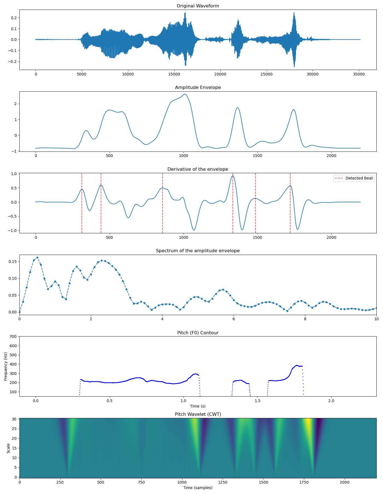

# Speech Feature Extractor
Tools to extract prosody-related speech features:
* Fundamental frequency curve (Praat method)
* Amplitude envelope (Bark-scale or vocalic energy)
* Vowel onset locations ("beats")
* Envelope spectrum
* OpenSMILE (eGeMAPS) features

# Functionality
The `feat_extractor` module provides the `sfe` class, which wraps two envelope extraction strategies (`bark`, `vocallic_energy`) plus pitch, wavelet, eGeMAPS, and optional MFCC feature extraction.

# Setup
1. **Install dependencies with conda**

   ```
   conda env create -f env.yml
   conda activate sfe
   ```

2. **Set up input folder**

   Audio files are discovered recursively under the input directory:

   ```
   input_dir/
       subdir_a/
           audio1.wav
           audio2.wav
       subdir_b/
           audio3.wav
       textgrids_gt/ (optional)
           audio1.TextGrid
           audio2.TextGrid
   ```

   Each audio filename must be unique across all subdirectories. Output keys are formed from the last two path components (`dirname_filename.wav`).

   Optionally, manually annotated textgrids can be placed under `textgrids_gt`. When `-plt` is used, ground-truth beats are plotted alongside detections. The ground-truth textgrid must contain a point tier named `beats` and its filename must match the wav's.

3. **Run the main script**

   ```
   python src/main.py -in <IN_DIR> -out <OUT_DIR> -env <bark|vocallic_energy> -sr <RATE>
   ```

   **Required arguments:**

   | Flag | Description |
   |------|-------------|
   | `-in`   | Directory with input `.wav` files (searched recursively) |
   | `-out`  | Output directory |
   | `-env`  | Envelope extraction method: `bark` or `vocallic_energy` |
   | `-sr`   | Target sampling rate. Files are resampled if their native rate differs. |

   **Optional arguments:**

   | Flag | Default | Description |
   |------|---------|-------------|
   | `-l`     | 700     | Bandpass filter left cutoff (Hz) — only used with `vocallic_energy` |
   | `-r`     | 1300    | Bandpass filter right cutoff (Hz) — only used with `vocallic_energy` |
   | `-D`     | 10      | Maximum audio duration (seconds). Longer files are skipped. |
   | `-d`     | 2       | Minimum audio duration (seconds). Shorter files are skipped. |
   | `-plt`   | —       | Save diagnostic plots in `[output_dir]/plots` |
   | `-tg`    | —       | Save beat TextGrids in `[output_dir]/textgrids` |
   | `-mfcc`  | —       | Compute 13-dim MFCCs around each detected beat frame |

   **Examples:**

   ```
   # Bark envelope, with plots
   python src/main.py -in data/audio -out data/out -env bark -sr 16000 -plt

   # Vocalic energy envelope, custom bandpass
   python src/main.py -in data/audio -out data/out -env vocallic_energy -l 800 -r 1500 -sr 16000
   ```

# Output Visualization



# Output format

Output is written to an LMDB file at `[output_dir]/feats.lmdb`. Keys are formed from the last two path components joined with `_` (e.g. `subdir_audio1.wav`). Values are pickled dictionaries.

## Loading data

```python
import lmdb
import pickle

env = lmdb.open("path/to/feats.lmdb", readonly=True)
with env.begin() as txn:
    entry = pickle.loads(txn.get(b"subdir_audio1.wav"))
```

## Entry fields

| Field | Type | Description |
|-------|------|-------------|
| `key`                  | str           | File identifier |
| `waveform`             | np.ndarray    | Resampled audio |
| `envelope`             | np.ndarray    | Amplitude envelope (1 kHz) |
| `envelope_derivative`  | np.ndarray    | Derivative of envelope (max-abs scaled) |
| `beats`                | list[int]     | Detected beat onset frame indices |
| `envelope_spectrum`    | np.ndarray    | FFT magnitude spectrum of envelope (up to 10 Hz) |
| `spectrum_freq_bins`   | np.ndarray    | Frequency bins for envelope_spectrum |
| `intervals`            | list[float]   | Inter-beat intervals (seconds) |
| `f0`                   | np.ndarray    | Log-F0 contour (resampled to 1 kHz) |
| `voiced_mask`          | np.ndarray    | Voiced/unvoiced mask (float) |
| `dur`                  | float         | Audio duration (seconds) |
| `egemaps`              | np.ndarray    | eGeMAPS LLD features (N_frames x N_feats) |
| `f0_wavelet`           | np.ndarray    | CWT of F0 contour (scales 1–31) |
| `mfcc_features`        | list[np.ndarray] | Per-beat 13-dim MFCCs (only if `-mfcc` was used) |

A `metadata.txt` summary (files processed, aggregate duration stats) is also written alongside the LMDB.

# Resumability

The pipeline checks the target LMDB before processing each file. If a key already exists, the file is skipped. To force a full re-run, delete or rename `feats.lmdb`.

# References
* [BeatExtractor — a similar implementation using Praat](https://github.com/pabarbosa/prosody-scripts/tree/master/BeatExtractor)
* Reference articles:

```
@article{CUMMINS1998145,
title = {Rhythmic constraints on stress timing in English},
journal = {Journal of Phonetics},
volume = {26},
number = {2},
pages = {145-171},
year = {1998},
issn = {0095-4470},
doi = {https://doi.org/10.1006/jpho.1998.0070},
url = {https://www.sciencedirect.com/science/article/pii/S0095447098900705},
author = {Fred Cummins and Robert Port}
}

@article{gibbonRhythmsRhythm2023,
  title = {The Rhythms of Rhythm},
  author = {Gibbon, Dafydd},
  date = {2023-04},
  journaltitle = {Journal of the International Phonetic Association},
  shortjournal = {Journal of the International Phonetic Association},
  volume = {53},
  number = {1},
  pages = {233--265},
  doi = {10.1017/S0025100321000086},
  langid = {english}
}

@article{tilsenLowfrequencyFourierAnalysis2008,
  title = {Low-Frequency {{Fourier}} Analysis of Speech Rhythm},
  author = {Tilsen, Sam and Johnson, Keith},
  date = {2008-08-01},
  journaltitle = {The Journal of the Acoustical Society of America},
  volume = {124},
  number = {2},
  pages = {EL34-EL39},
  doi = {10.1121/1.2947626},
  langid = {english}
}
```
